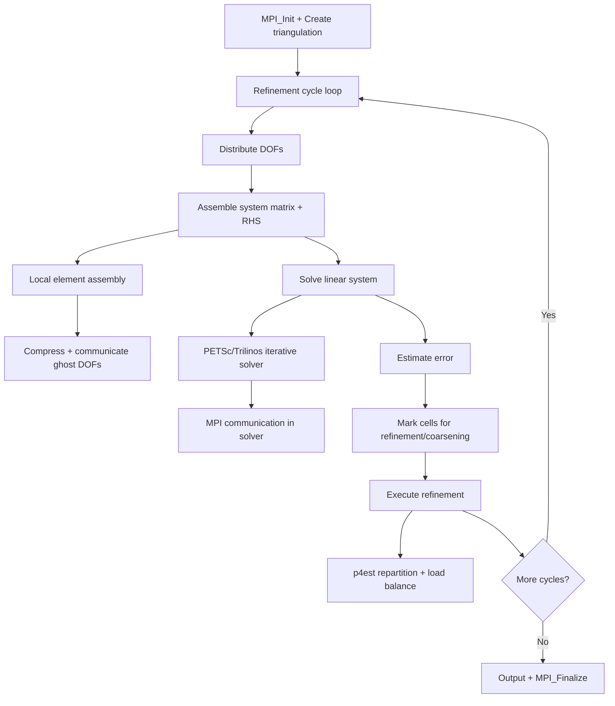

# deal.II Computation Flow

## Overview
deal.II is an adaptive finite element framework. A typical simulation iteratively refines the mesh based on error estimators, solves the PDE on each refined mesh, and outputs results. Uses MPI via p4est for distributed triangulation.

## Main Loop

## MPI Communication
- **p4est**: manages distributed octree mesh, handles repartitioning
- **Linear algebra**: PETSc or Trilinos distributed vectors/matrices
- **Ghost exchange**: automatic for finite element DOF values

## I/O Points
- VTU output for visualization (per-rank files)
- Checkpoint: Triangulation serialization to file
