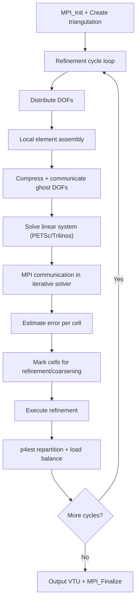

# deal.II Computation Flow

## Overview
deal.II is an adaptive finite element framework. A typical simulation iteratively refines the mesh based on error estimators, solves the PDE on each refined mesh, and outputs results. Uses MPI via p4est for distributed triangulation.

## Main Loop



## MPI Communication
- **p4est**: manages distributed octree mesh, handles repartitioning
- **Linear algebra**: PETSc or Trilinos distributed vectors/matrices
- **Ghost exchange**: automatic for finite element DOF values

## I/O Points
- VTU output for visualization (per-rank files)
- Checkpoint: Triangulation serialization to file

## Output Format
```
Cycle 0:
   Number of active cells:       1024
   Number of degrees of freedom: 4225
   Solver converged in 28 iterations.
   ||u||_L2 = 0.00368
```
**How to compare**: extract `||u||_L2` norm from the final cycle; numeric comparison with tolerance ~1e-4. Or compare VTU output files with `pvpython` diff.
