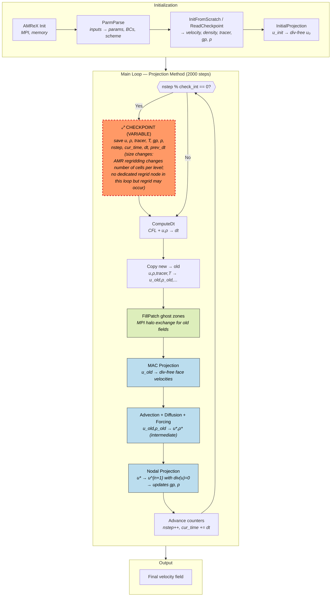
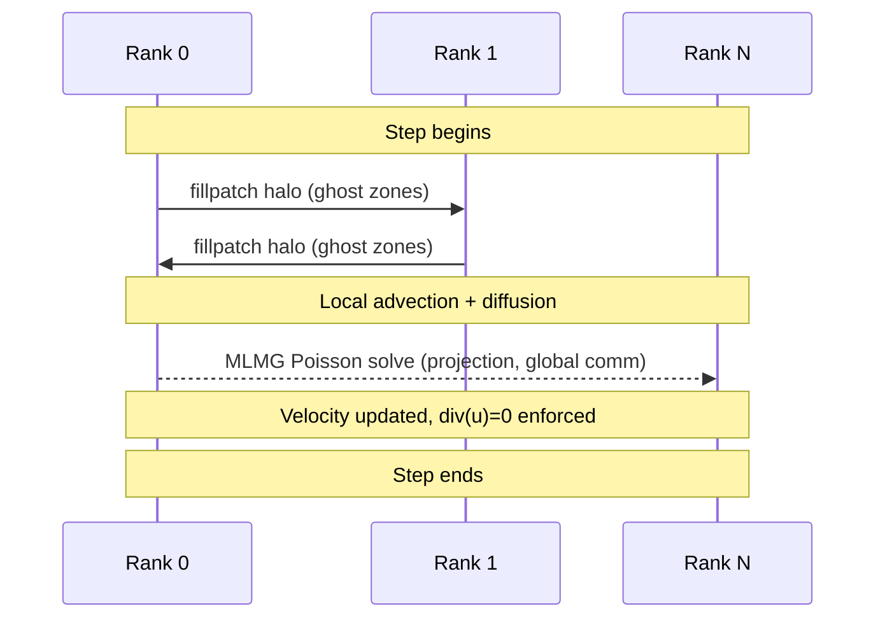
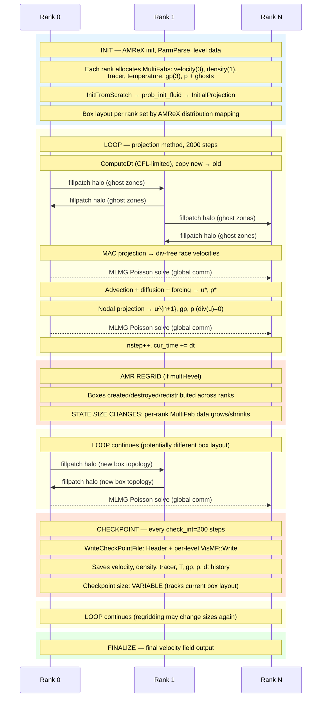

# incflo — Incompressible Navier-Stokes Solver

**Category:** Iterative / Fixed state  
**Language:** C++ (MPI)  
**Checkpoint library:** AMReX native checkpoint (`WriteCheckPointFile`/`ReadCheckpointFile`)

## Application Description

incflo is an AMReX-based solver for the incompressible Navier-Stokes equations with variable density and optional passive scalars, temperature, and embedded boundary (EB) geometry. The benchmark uses the `inputs.poiseuille_annulus` test case: pressure-driven viscous flow through a 3D annular channel (outer radius 1.0, inner radius 0.25), with an imposed cyclic pressure gradient driving flow along the z-axis. The domain is 40x40x10 cells, mu=0.001, rho=1.0. A projection method enforces incompressibility via a Poisson solve for pressure.

## Computation Workflow



**Data flow per step:** `u_old,ρ_old` →(MAC project)→ `u_face` →(advect+diffuse)→ `u*,ρ*` →(nodal project, Poisson solve)→ `u^{n+1}, gp, p`

### Start

1. **AMReX initialization** (`amrex::Initialize`) — MPI, GPU, memory management.
2. **Constructor** — read all input parameters (`ParmParse`), set up EB geometry if needed, allocate level data arrays, initialize boundary conditions and advection scheme.
3. **Data initialization** (`InitData`):
   - **Fresh start:** `InitFromScratch()` -> `MakeNewLevelFromScratch()` -> `prob_init_fluid()` sets initial velocity and density; `InitialProjection()` makes velocity divergence-free; `InitialIterations()` performs initial pressure iterations.
   - **Restart:** `ReadCheckpointFile()` restores complete state from disk.

### Main Loop (projection method, 2000 steps)

Driven by `Evolve()`:

Each step calls `Advance()`:

1. **Compute dt** (`ComputeDt`) — CFL-limited timestep.
2. **Copy fields** — new -> old (velocity, density, tracer, temperature).
3. **Ghost fill** — `fillpatch` ghost zones for old fields.
4. **Predictor** (`ApplyPredictor`):
   - Compute MAC-projected face velocities (divergence-free advection velocities).
   - Compute advection terms (upwind/Godunov/MOL).
   - Compute diffusion terms (explicit or via MLMG linear solver).
   - Compute forcing.
   - Update velocity, density, tracer, temperature to intermediate state.
   - Apply nodal/CC projection to enforce `div(u)=0` -> updates pressure gradient `gp` and pressure `p`.
5. **Corrector** (`ApplyCorrector`, if MOL) — second-order correction step.
6. **Advance counters** — `m_nstep++`, `m_cur_time += m_dt`.
7. **Checkpoint** — if `m_nstep % m_check_int == 0`.
8. **Plot output** — if output interval reached.

### End

- When `m_nstep >= m_max_step` (2000) or `m_cur_time >= m_stop_time`.
- **Validation output:** stdout containing AMReX version/build info.

## Critical State

Per AMR level (`m_leveldata[lev]`):

| Field | Type | Evolution |
|-------|------|-----------|
| `velocity` | Face-staggered or cell-centered u, v, w (`MultiFab`) | Primary evolved quantity; updated each step by advection + diffusion + projection |
| `density` | Scalar rho field (`MultiFab`) | Updated each step (rho=1.0 constant in this benchmark) |
| `tracer` | Passive scalar(s) (`MultiFab`) | Updated each step if present |
| `temperature` | Temperature field (`MultiFab`) | Updated each step if present |
| `gp` | Pressure gradient vector (`MultiFab`) | Retained across steps for incremental projection |
| `p_nd` or `p_cc` | Pressure field (`MultiFab`) | Lagrange multiplier enforcing div(u)=0 |

Time-stepping scalars:
| Field | Type | Evolution |
|-------|------|-----------|
| `m_nstep` | Step counter | Incremented each step |
| `m_cur_time` | Physical time | Advanced by `m_dt` each step |
| `m_dt`, `m_prev_dt`, `m_prev_prev_dt` | Current and previous timesteps | History needed for BDF2 time integrator |

**Why pressure must be saved:** The projection method uses pressure from the previous step as initial guess for the current step's Poisson solve (incremental projection). Missing `gp` would produce a transient error on the first post-restart step.

**Why dt history must be saved:** `m_prev_dt` and `m_prev_prev_dt` ensure the BDF2 time integrator has correct history for its second-order backward-difference stencil.

## MPI Task Lifetime

**Per-rank state:** Each rank owns a subset of AMReX boxes per AMR level, containing `MultiFab` data for velocity, density, tracer, temperature, pressure gradient `gp`, and pressure `p`. Ghost cells are filled via `fillpatch` each step.

**How state changes:** Per-rank data stays fixed in size for this single-level benchmark. Values evolve each step through advection, diffusion, and projection. In multi-level runs, regridding can change the box layout and redistribute data across ranks.

**Communication pattern:** Each step uses `fillpatch` MPI halo exchange for ghost zones, plus MLMG multigrid solvers that perform global communication (reductions and neighbor exchanges) during the MAC and nodal pressure projections.



### Application Lifetime View



**Key observations:**

- **State size can change during execution.** AMR regridding can create, destroy, or redistribute boxes across ranks at any level, changing the per-rank MultiFab data sizes. In this single-level benchmark the layout is static, but the code fully supports dynamic regridding.
- **Communication combines nearest-neighbor and global patterns.** Each step uses `fillpatch` for ghost-zone halo exchange, plus two MLMG multigrid Poisson solves (MAC and nodal projections) that require global reductions and multi-level neighbor exchanges — significantly more communication than pure halo-exchange codes.
- **Checkpoint size tracks the current AMR state.** The `chkNNNNN/` directory stores per-level BoxArrays and all MultiFab fields. If regridding has changed the number of cells on any level since the last checkpoint, the new checkpoint will be a different size.

## Checkpoint Protection

### Write trigger

```cpp
if (m_check_int > 0 && (m_nstep % m_check_int == 0))
    WriteCheckPointFile();
```

The checkpointed run passes `amr.check_int=200` on the command line.

### What is saved

Directory `chkNNNNN/` containing:
- **`Header`** (ASCII): checkpoint version, `finest_level`, `m_nstep`, `m_cur_time`, `m_dt`, `m_prev_dt`, `m_prev_prev_dt`, domain bounding box, per-level BoxArrays.
- **Per-level binary data** via `VisMF::Write()`: `velocity`, `density`, `tracer` (if ntrac>0), `temperature` (if used), `gp` (pressure gradient), `p_cc` or `p_nd` (pressure).
- **`incflo_job_info`**: build information and all input parameters.

### Restart protocol

1. Read `Header` to restore `finest_level`, `m_nstep`, `m_cur_time`, `m_dt`, and BoxArray geometry.
2. `MakeNewLevelFromScratch()` on each level to allocate arrays (without calling `prob_init_fluid()`).
3. Read each MultiFab field from binary via `VisMF::Read()`.
4. Optionally regrid and redistribute.
5. Time stepping resumes from restored state.

### Restart trigger

```cpp
if (m_restart_file.empty()) { InitFromScratch(...); }
else { ReadCheckpointFile(); }
```

### Restart script

```bash
CKPT=$(ls -td chk????? 2>/dev/null | head -1)
./_build/incflo.ex ... "amr.restart=$CKPT"
```

Finds the most recent checkpoint directory and passes it as `m_restart_file`.

### Vanilla difference

The vanilla run uses `amr.check_int=-1` (disabled) and no restart command. The checkpoint/restart infrastructure exists in both vanilla and checkpointed source trees — the difference is purely in runtime configuration.
