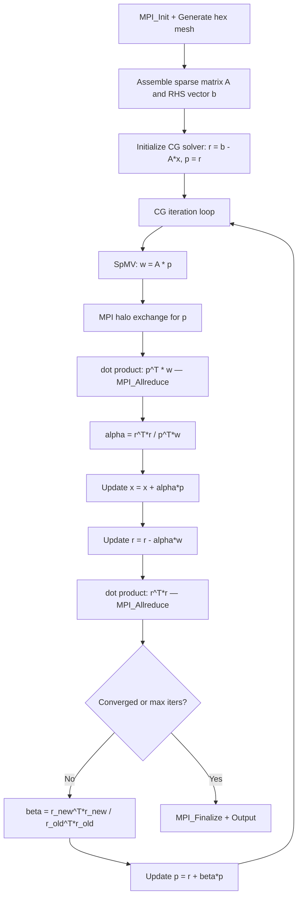

# miniFE Computation Flow

## Overview
miniFE is a proxy application for unstructured implicit finite element codes. It generates a simple 3D hex mesh, assembles a sparse linear system (stiffness matrix and load vector), and solves it using a conjugate gradient (CG) iterative solver. Each MPI rank owns a contiguous block of mesh nodes; the sparse matrix is distributed by rows across ranks.

## Main Loop

## MPI Communication Pattern
- **Halo exchange**: `MPI_Isend`/`MPI_Irecv`/`MPI_Waitall` to exchange shared node values before each SpMV; communication pattern derived from the sparse matrix non-zero structure
- **Global reductions**: `MPI_Allreduce(MPI_SUM)` for dot products (two per CG iteration: one for `p^T*w`, one for `r^T*r`)
- **Decomposition**: 1D row-based distribution of the sparse matrix; each rank owns a contiguous range of global node IDs

## I/O Points
- Final output: prints solver iteration count, final residual norm, and timing breakdown to stdout
- No intermediate file output in the default configuration
