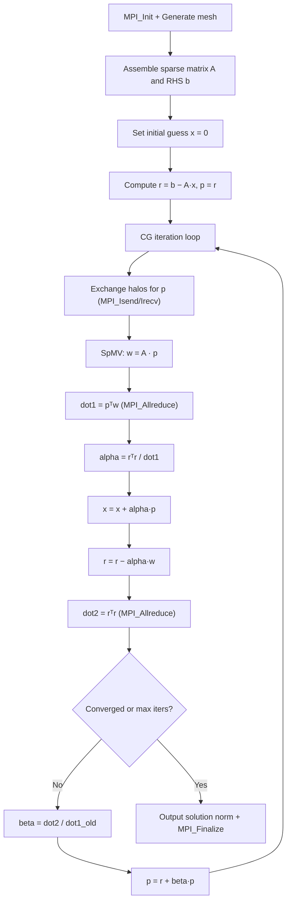

# miniFE Computation Flow

## Overview
miniFE is a sparse finite element proxy app implementing a conjugate gradient (CG) solver on a 3D structured mesh. The assembled sparse matrix and vectors are distributed across MPI ranks.

## Main Loop



## MPI Communication
- **Halo exchange**: `MPI_Isend`/`MPI_Irecv`/`MPI_Waitall` for ghost DOF values before SpMV
- **Global reduction**: `MPI_Allreduce(MPI_SUM)` for dot products (2 per CG iteration)
- **Decomposition**: structured 3D mesh partitioned by node ownership

## I/O Points
- Final: solution norm and iteration count to stdout
- YAML output file with timing breakdown

## Output Format
```
Final Resid Norm: 3.456789e-07
Number of iterations: 200
Total CG Time: 1.234 seconds
```
**How to compare**: extract `Final Resid Norm`; numeric comparison with tolerance ~1e-6.
