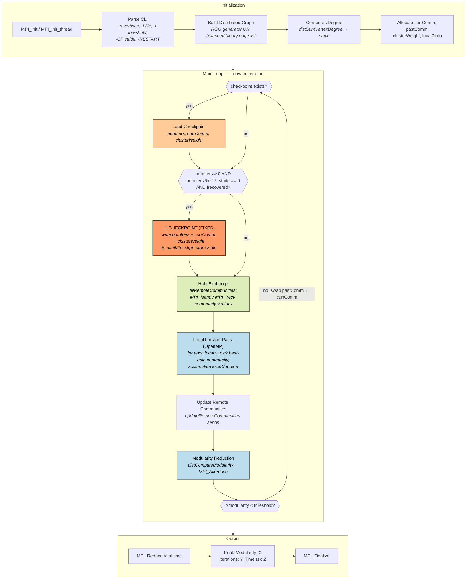
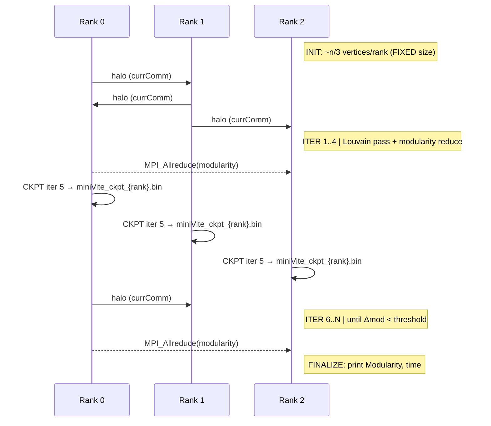

# miniVite — Distributed Louvain Community Detection

**Category:** Dynamic / Fixed state
**Language:** C++ (MPI + OpenMP)
**Checkpoint library:** POSIX file I/O (native binary, replaces an earlier FTI integration)

## Application Description

miniVite is a proxy application for distributed-memory graph clustering using the Louvain method, developed at PNNL as part of ExaGraph. It iteratively assigns vertices to communities so as to maximize global modularity, an objective that measures how much denser intra-community edges are versus a random null model. Each rank owns a disjoint subset of the vertex set; the topology is fixed at load time but the community assignment evolves until modularity converges. The checkpointed variant adds a small POSIX file-based protocol so a killed run can resume from the last completed iteration.

## Computation Workflow



**Data flow per iteration:** `currComm,vDegree` →(halo)→ `currComm + remoteComm` →(Louvain)→ `targetComm,localCupdate` →(reduce)→ `clusterWeight'` →(modularity)→ `Δmod` → swap into `pastComm`.

### Start

1. **MPI initialization** — `MPI_Init` (or `MPI_Init_thread` when OpenMP enabled).
2. **CLI parsing** — graph size or input file, modularity threshold (`-t`), checkpoint stride (`-CP`), optional `-RESTART` flag, plus failure-injection flags (`-PROCFI`, `-NODEFI`) used only by the resilience tests.
3. **Graph construction** — either generate a Random Geometric Graph in memory or read a balanced binary edge list. Each rank ends up with `~n/P` vertices and the corresponding edges.
4. **Static derived data** — per-vertex degree (`vDegree`) is computed once via `distSumVertexDegree` and never changes thereafter.
5. **Working arrays** — `currComm`, `pastComm`, `clusterWeight`, `localCinfo` (each sized to the local vertex count) are allocated and initialized so every vertex starts in its own community.

### Main Loop (Louvain iteration)

Every outer iteration does six things in order:

1. **Checkpoint check / restore** at the very top: if a `miniVite_ckpt_<rank>.bin` file is found, load `numIters`, `currComm`, and `clusterWeight`, copy `currComm` into `pastComm`, and set `recovered = 1` so this iteration does not immediately re-write the checkpoint we just loaded.
2. **Periodic checkpoint write** — every `CP_stride` iterations (default 5), serialize the small per-rank state to disk.
3. **Halo exchange** — `fillRemoteCommunities` issues `MPI_Isend` / `MPI_Irecv` pairs so each rank knows the current community of every neighbor that lives on another rank.
4. **Local Louvain pass** — an OpenMP-parallel loop over local vertices; each vertex is reassigned to the neighboring community that yields the highest modularity gain. Updates are accumulated in `localCupdate`.
5. **Reduce + broadcast** — `updateRemoteCommunities` sends each rank's community-weight deltas to the ranks that own those communities so global `clusterWeight` stays consistent.
6. **Modularity** — `distComputeModularity` sums local contributions, then a single `MPI_Allreduce` produces the global value. If the gain over the previous iteration is below `threshold`, the loop exits; otherwise `pastComm ← currComm` and the next iteration begins.

### End

- Final `MPI_Reduce` of accumulated wall time.
- Rank 0 prints `Modularity: <value>`, total iterations, and wall time.
- Optional accumulated `acc_write_time` for the checkpoint cost.
- `MPI_Finalize`.
- **Validation output:** the `Modularity:` value on the final printed line — the harness matches this via `keep_patterns: ["Modularity"]` in `app.yaml`.

## Critical State

The simulation state is small per rank because the graph topology is static — only the *assignment* changes.

| Field | Type | Evolution |
|-------|------|-----------|
| `currComm[i]` | `GraphElem` (int64), size = local vertex count | Reassigned each iteration; converges when modularity gain < threshold |
| `clusterWeight[i]` | `double`, same size | Sum of edge weights inside each community; updated by `updateRemoteCommunities` |
| `numIters` | `int` | Outer-loop counter; controls when the next checkpoint fires |
| `vDegree[i]` | `double`, same size | Per-vertex total edge weight; static after `distSumVertexDegree` |
| `localCinfo[i]` | `Comm` struct (size + degree) | Per-community summary; recomputed each iteration |
| `remoteComm` | `unordered_map<GraphElem, GraphElem>` | Communities of remote neighbors; refreshed each halo exchange |
| `Graph::edge_list_`, `edge_indices_` | distributed `Edge` arrays | Fixed after load; never modified during Louvain |

**Saved by checkpoint (only):** `numIters`, `currComm`, `clusterWeight`. Everything else is either static (`vDegree`, graph) or recomputable from `currComm` + topology (`localCinfo`, `remoteComm`).

## MPI Task Lifetime

**Per-rank state shape:** Each rank owns a disjoint slice of `~n/P` vertices. The local arrays (`currComm`, `clusterWeight`, `vDegree`, `localCinfo`) are sized to that slice and **never resize** — vertices do not migrate between ranks. This is what makes the cell *fixed*; the *dynamic* axis is that the values inside those arrays evolve until convergence.

**How state changes:** Community assignments are refined each iteration. The set of communities a rank "knows about" (via `remoteComm`) varies because neighboring ranks reassign vertices, but the per-rank memory footprint is stable.

**Communication pattern:**

- Per iteration: an effectively all-to-all community-vector exchange via `MPI_Isend` / `MPI_Irecv` so every rank sees the current community of every cross-rank neighbor.
- Per iteration: a 2-element `MPI_Allreduce` (local + global edge-weight sums) for the modularity computation.
- One `MPI_Barrier` after initialization and one after the loop exits.
- An optional one-sided variant (`USE_MPI_RMA`) replaces point-to-point with `MPI_Win` get/put.

```mermaid
sequenceDiagram
    participant R0 as Rank 0
    participant R1 as Rank 1
    participant RN as Rank N

    Note right of RN: Iteration K — local vertices unchanged in size
    R0->>R1: MPI_Isend community vector (currComm slice)
    R1->>R0: MPI_Isend community vector
    R0->>RN: ... (effectively all-to-all)
    Note right of RN: Local Louvain pass (OpenMP)
    R0->>R1: updateRemoteCommunities deltas
    R0-->>RN: MPI_Allreduce(local mod, total weight)
    Note right of RN: convergence check; if below threshold → exit
```

### Application Lifetime View



**Key observations:**
- Each rank's working set is a **fixed-size slice** of vertex IDs — Louvain refines values, never resizes the arrays.
- Communication is **dense** (every rank exchanges with every rank that owns a neighbor) — closer to all-to-all than nearest-neighbor.
- Checkpoint is **per-rank independent** — there is no inter-rank coordination during the write, because each rank's slice is self-contained relative to topology.

## Checkpoint Protection

### Write trigger

In `dspl.hpp` at the top of the outer loop:

```c++
if (!recovered && numIters > 0 && numIters % CP_stride == 0)
    write_checkpoint(...);
```

`CP_stride` defaults to 5 and is set via `-CP <N>` on the command line. The `recovered` guard prevents an immediate re-write right after restoring from disk.

### What is saved

Each rank writes its own file `miniVite_ckpt_<rank>.bin` containing exactly:

- `numIters` — current outer-loop counter (`int`).
- `currComm` — vector size (`size_t`) followed by the raw `GraphElem` (`int64`) array.
- `clusterWeight` — vector size (`size_t`) followed by the raw `double` array.

No graph topology, no degrees, no per-community metadata.

### Write protocol

`simple_checkpoint.h::write_checkpoint`:

1. `fopen(path, "wb")` to open binary write mode.
2. Sequential `fwrite` calls for the iteration counter, the two vector sizes, and the two raw arrays.
3. `fclose` — no explicit `fsync`. The benchmark assumes the kill signal lands between checkpoint writes, not in the middle of one.

### Restart protocol

`simple_checkpoint.h::checkpoint_exists` + `read_checkpoint`:

1. At the very top of each iteration, attempt to `fopen` in read mode. If the file exists, restore `numIters`, `currComm`, `clusterWeight` in the same order they were written.
2. Copy `currComm` into `pastComm` so the convergence check makes sense on the first post-restart iteration.
3. Set `recovered = 1` so the per-iteration checkpoint guard skips the immediate write that would otherwise duplicate the file we just loaded.

### Consistency

Single-file write per rank, no atomic rename, no double-buffering, no `fsync`. A crash mid-write would corrupt that rank's file. Across ranks the writes are independent — there is no two-phase commit — but because the graph topology is static, restart only needs each rank's per-vertex assignment to be self-consistent, not a global snapshot at one wall-clock instant.
