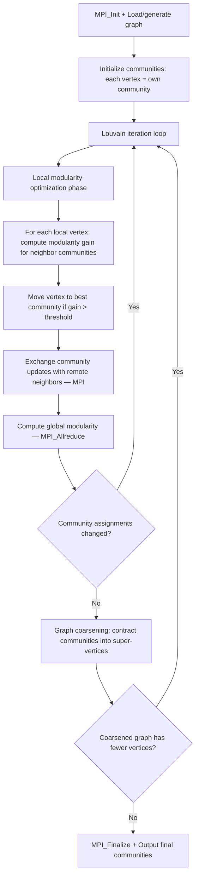

# miniVite Computation Flow

## Overview
miniVite is a proxy application for parallel community detection using the Louvain method. It takes a distributed graph as input and iteratively assigns vertices to communities by optimizing modularity. Each MPI rank owns a partition of the graph vertices; OpenMP threads parallelize local computation within each rank.

## Main Loop



## MPI Communication Pattern
- **Community exchange**: `MPI_Isend`/`MPI_Irecv`/`MPI_Waitall` to send updated community labels for ghost vertices to neighboring ranks
- **Global reduction**: `MPI_Allreduce(MPI_SUM)` for computing global modularity and tracking total community changes
- **Decomposition**: graph partitioned across ranks by vertex ID ranges; edges crossing rank boundaries require ghost vertex communication

## I/O Points
- Input: reads graph from file (Matrix Market, binary edge list) or generates synthetic graph (e.g., Kronecker/RMAT)
- Final output: prints modularity score, number of communities, iteration count, and timing to stdout
- Optional: write community assignments to file

## Output Format
```
Modularity, #Iterations: 0.456789, 15
Number of communities: 42
```
**How to compare**: extract `Modularity` value; numeric comparison with tolerance ~1e-4. Community count should be exact.
